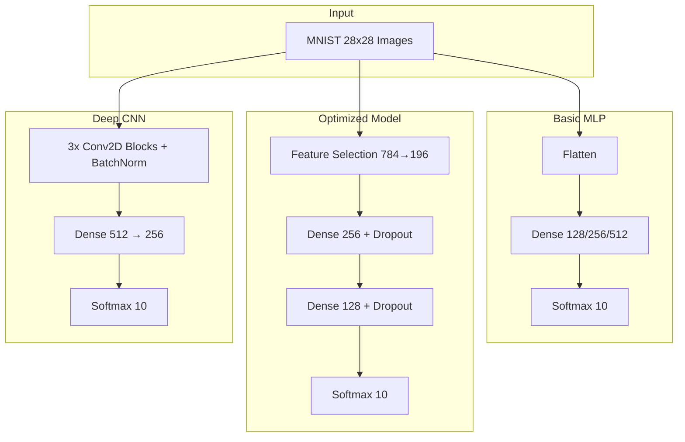

<div align="center">

# MNIST Handwritten Digit Recognition

**Advanced digit recognition with three neural network architectures — MLP, Optimized, and Deep CNN.**

[](https://python.org)
[](https://tensorflow.org)
[](LICENSE)
[](https://github.com/ChanMeng666/mnist-handwritten-digit-recognition-project/stargazers)

</div>

---

A modular Python package that implements and compares three neural network approaches for handwritten digit classification on the MNIST dataset. Includes comprehensive evaluation, sensitivity analysis, and visualization tools. Achieves **99.71% accuracy** with the Deep CNN model.

## Key Features

- **Three model architectures** with different accuracy/speed tradeoffs
- **Feature selection pipeline** reducing input from 784 to 196 dimensions
- **Comprehensive evaluation** — confusion matrices, classification reports, error analysis
- **Sensitivity analysis** — gradient importance, perturbation robustness, occlusion maps
- **Interactive demo notebook** for hands-on experimentation

## Performance

| Model | Accuracy | Prediction Time | Parameters | Best For |
|:------|:---------|:----------------|:-----------|:---------|
| Basic MLP | 99.05% | 0.621s | 407,050 | Balanced performance |
| Optimized | 97.86% | 0.528s | 84,618 | Resource-constrained environments |
| **Deep CNN** | **99.71%** | 4.869s | 1,015,530 | Maximum accuracy |

## Architecture



## Project Structure

```
mnist-handwritten-digit-recognition-project/
├── src/mnist_recognition/       # Python package
│   ├── config.py                # Hyperparameters
│   ├── data/                    # Loading, preprocessing, augmentation, feature selection
│   ├── models/                  # Basic MLP, Optimized, Deep CNN
│   ├── evaluation/              # Metrics, error analysis, report generation
│   └── visualization/           # Training curves, comparisons, sensitivity maps
├── notebooks/
│   └── demo.ipynb               # Interactive demo notebook
├── pyproject.toml               # Package configuration
├── requirements.txt             # Dependencies
├── CONTRIBUTING.md              # Contribution guidelines
├── CODE_OF_CONDUCT.md           # Community guidelines
└── LICENSE                      # MIT License
```

## Getting Started

### Prerequisites

- Python 3.8+
- pip

GPU support is optional but recommended for training.

### Installation

```bash
# Clone the repository
git clone https://github.com/ChanMeng666/mnist-handwritten-digit-recognition-project.git
cd mnist-handwritten-digit-recognition-project

# Create a virtual environment (recommended)
python -m venv venv
source venv/bin/activate  # On Windows: venv\Scripts\activate

# Install the package
pip install -e .
```

### Quick Start

Run the demo notebook for a guided walkthrough:

```bash
jupyter notebook notebooks/demo.ipynb
```

Or use the package directly in Python:

```python
from mnist_recognition.data.loader import load_mnist
from mnist_recognition.data.preprocessing import preprocess_data
from mnist_recognition.data.augmentation import create_data_generators
from mnist_recognition.models.deep_cnn import create_and_train_deep_model
from mnist_recognition.config import DEFAULT_CONFIG

# Load and preprocess
(x_train_raw, y_train_raw), (x_test_raw, y_test_raw) = load_mnist()
(x_train, y_train), (x_val, y_val), (x_test, y_test) = preprocess_data(
    x_train_raw, x_test_raw, y_train_raw, y_test_raw
)

# Create data generators
config = DEFAULT_CONFIG.copy()
train_gen, val_gen = create_data_generators(
    x_train, y_train, x_val, y_val, config["batch_size"]
)

# Train the Deep CNN model
model, results = create_and_train_deep_model(config, train_gen, val_gen)
```

## Model Details

### Basic MLP

A multi-layer perceptron that flattens the 28x28 image and passes it through a single dense hidden layer. Tests three configurations (128, 256, 512 neurons) and selects the best.

### Optimized Model

Uses ANOVA F-value feature selection to reduce input dimensionality from 784 to 196 features, then trains a compact two-layer network with dropout. Achieves a 79% reduction in parameters while maintaining good accuracy.

### Deep CNN

Three convolutional blocks, each with two Conv2D layers, batch normalization, ReLU activation, max pooling, and dropout. Followed by dense layers (512 → 256 → 10). Uses gradient clipping and learning rate scheduling.

## Tech Stack

| Category | Tools |
|:---------|:------|
| Deep Learning | TensorFlow / Keras |
| Data Processing | NumPy, Pandas |
| Visualization | Matplotlib, Seaborn, Plotly |
| Feature Selection | scikit-learn |
| Environment | Jupyter Notebook |

## Contributing

Contributions are welcome! See [CONTRIBUTING.md](CONTRIBUTING.md) for guidelines.

## License

This project is licensed under the [MIT License](LICENSE).

## Author

**Chan Meng**

- GitHub: [@ChanMeng666](https://github.com/ChanMeng666)
- LinkedIn: [chanmeng666](https://www.linkedin.com/in/chanmeng666/)
- Website: [chanmeng.org](https://chanmeng.org/)
