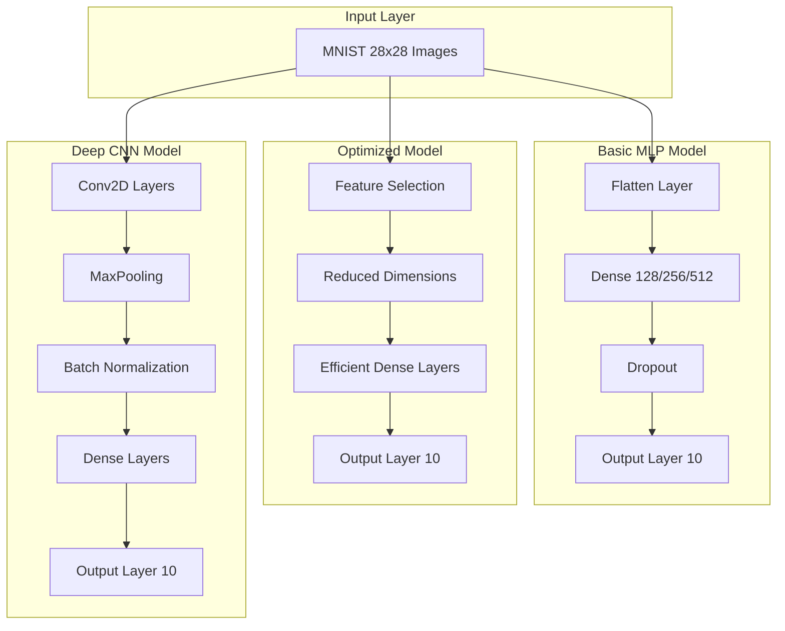

<div align="center"><a name="readme-top"></a>

# 🧠 MNIST Neural Network Analysis<br/><h3>Advanced Handwritten Digit Recognition with Deep Learning</h3>

A comprehensive neural network implementation that leverages cutting-edge deep learning techniques to achieve state-of-the-art handwritten digit recognition.<br/>
Supports **multiple model architectures**, **extensive performance analysis**, and **advanced visualization techniques**.<br/>
One-click **FREE** deployment of your digit recognition models.

[Live Demo][demo-link] · [Documentation][docs-link] · [Research Paper][paper-link] · [Issues][github-issues-link]

<br/>

[][demo-link]

<br/>

<!-- SHIELD GROUP -->

[![][github-release-shield]][github-release-link]
[![][github-stars-shield]][github-stars-link]
[![][github-forks-shield]][github-forks-link]
[![][github-issues-shield]][github-issues-link]
[![][github-license-shield]][github-license-link]<br/>
[![][python-shield]][python-link]
[![][tensorflow-shield]][tensorflow-link]
[![][jupyter-shield]][jupyter-link]
[![][matplotlib-shield]][matplotlib-link]

**Share This Project**

[![][share-x-shield]][share-x-link]
[![][share-linkedin-shield]][share-linkedin-link]
[![][share-reddit-shield]][share-reddit-link]

<sup>🌟 Pioneering the future of computer vision and deep learning. Built for researchers and practitioners.</sup>

## 📸 Project Showcase

> [!TIP]
> This project demonstrates three distinct neural network architectures with comprehensive performance analysis.

<div align="center">
  
  <p><em>MNIST Handwritten Digits Dataset - 28x28 Grayscale Images</em></p>
</div>

<div align="center">
  
  
  <p><em>Neural Network Architectures and Performance Comparison</em></p>
</div>

<details>
<summary><kbd>📊 More Visualizations</kbd></summary>

<div align="center">
  
  <p><em>Training Progress and Validation Accuracy</em></p>
</div>

<div align="center">
  
  <p><em>Detailed Error Analysis and Confusion Matrix</em></p>
</div>

</details>

**Tech Stack Highlights:**

<div align="center">

 
 
 
 
 
 
 

</div>

</div>

> [!IMPORTANT]
> This project demonstrates modern deep learning practices with **TensorFlow/Keras**. It combines **comprehensive data analysis** with **multiple neural network architectures** to provide **state-of-the-art digit recognition**. Features include **99.71% accuracy**, **advanced visualization**, and **detailed performance analysis**.

<details>
<summary><kbd>📑 Table of Contents</kbd></summary>

#### TOC

- [🧠 MNIST Neural Network AnalysisAdvanced Handwritten Digit Recognition with Deep Learning](#-mnist-neural-network-analysisadvanced-handwritten-digit-recognition-with-deep-learning)
  - [📸 Project Showcase](#-project-showcase)
      - [TOC](#toc)
      - [](#)
  - [🌟 Introduction](#-introduction)
  - [✨ Key Features](#-key-features)
    - [`1` Multiple Model Architectures](#1-multiple-model-architectures)
    - [`2` Comprehensive Analysis Suite](#2-comprehensive-analysis-suite)
    - [`*` Advanced Features](#-advanced-features)
  - [🛠️ Tech Stack](#️-tech-stack)
  - [🏗️ Architecture](#️-architecture)
    - [Neural Network Architectures](#neural-network-architectures)
    - [Project Structure](#project-structure)
  - [⚡️ Performance](#️-performance)
    - [Model Performance Comparison](#model-performance-comparison)
    - [Key Performance Metrics](#key-performance-metrics)
  - [🚀 Getting Started](#-getting-started)
    - [Prerequisites](#prerequisites)
    - [Quick Installation](#quick-installation)
    - [Environment Setup](#environment-setup)
  - [📖 Usage Guide](#-usage-guide)
    - [Basic Usage](#basic-usage)
    - [Model Training](#model-training)
    - [Advanced Configuration](#advanced-configuration)
  - [🔬 Model Details](#-model-details)
    - [Basic MLP Model](#basic-mlp-model)
    - [Optimized Model](#optimized-model)
    - [Deep CNN Model](#deep-cnn-model)
  - [📊 Results \& Analysis](#-results--analysis)
    - [Performance Summary](#performance-summary)
    - [Advanced Analysis Features](#advanced-analysis-features)
  - [🤝 Contributing](#-contributing)
    - [Development Process](#development-process)
    - [Contribution Areas](#contribution-areas)
  - [📄 License](#-license)
  - [👥 Author](#-author)

####

<br/>

</details>

## 🌟 Introduction

We are passionate researchers creating next-generation **computer vision** solutions. By adopting modern deep learning practices and cutting-edge neural network architectures, we aim to provide researchers and practitioners with powerful, scalable, and interpretable digit recognition models.

Whether you're a student, researcher, or industry professional, this project will be your **machine learning** playground. Please note that this project demonstrates research-quality implementations with extensive documentation and analysis.

> [!NOTE]
> - Python 3.7+ required
> - TensorFlow 2.0+ for deep learning capabilities
> - Jupyter Notebook for interactive analysis
> - GPU support optional but recommended for training

| [![][demo-shield-badge]][demo-link] | No installation required! Experience our models through the interactive demo. |
| :---------------------------------- | :---------------------------------------------------------------------------- |

> [!TIP]
> **⭐ Star us** to receive all release notifications and stay updated with the latest research!

[![][image-star]][github-stars-link]

## ✨ Key Features

### `1` Multiple Model Architectures

Experience three distinct neural network approaches, each optimized for different use cases. Our comprehensive implementation provides unprecedented **flexibility** and **performance analysis** through advanced **deep learning methodologies**.

<div align="center">
  
  <p><em>Three distinct model architectures with performance trade-offs</em></p>
</div>

**Available Models:**
- 🧠 **Basic MLP Model**: Simple yet effective multi-layer perceptron
- ⚡ **Optimized Model**: Feature-selected, resource-efficient implementation  
- 🚀 **Deep CNN Model**: Advanced convolutional neural network with state-of-the-art accuracy

[![][back-to-top]](#readme-top)

### `2` Comprehensive Analysis Suite

Revolutionary **analysis toolkit** that transforms how researchers understand model behavior. With our advanced visualization algorithms and intuitive metrics, users can **gain deep insights** while maintaining **research-grade accuracy**.

<div align="center">
  
  
  <p><em>Comprehensive Analysis - Data Exploration (left) and Performance Metrics (right)</em></p>
</div>

**Analysis Features:**
- **Data Exploration**: Complete MNIST dataset analysis with class distribution
- **Feature Importance**: Advanced pixel importance visualization and analysis
- **Performance Metrics**: Detailed accuracy, precision, recall, and F1-score analysis

[![][back-to-top]](#readme-top)

### `*` Advanced Features

Beyond the core models, this project includes:

- [x] 🎯 **99.71% Accuracy**: State-of-the-art digit recognition performance
- [x] 📊 **Comprehensive Visualization**: Beautiful plots and interactive analysis
- [x] 🔍 **Sensitivity Analysis**: Advanced model behavior understanding
- [x] ⚡ **Performance Optimization**: Multiple speed/accuracy trade-off options
- [x] 📈 **Training Monitoring**: Real-time training progress and validation tracking
- [x] 🧪 **Error Analysis**: Detailed misclassification investigation
- [x] 🔬 **Feature Selection**: Advanced dimensionality reduction techniques
- [x] 📝 **Research Documentation**: Comprehensive methodology and results documentation

> ✨ More features are continuously being added as deep learning research evolves.

<div align="right">

[![][back-to-top]](#readme-top)

</div>

## 🛠️ Tech Stack

<div align="center">
  <table>
    <tr>
      <td align="center" width="96">
        
        <br>Python 3.7+
      </td>
      <td align="center" width="96">
        
        <br>TensorFlow 2.0+
      </td>
      <td align="center" width="96">
        
        <br>Keras
      </td>
      <td align="center" width="96">
        
        <br>NumPy
      </td>
      <td align="center" width="96">
        
        <br>Pandas
      </td>
      <td align="center" width="96">
        
        <br>Jupyter
      </td>
    </tr>
  </table>
</div>

**Core Dependencies:**
- **Deep Learning**: TensorFlow 2.0+ with Keras API
- **Data Processing**: NumPy, Pandas for efficient data manipulation
- **Visualization**: Matplotlib, Seaborn, Plotly for comprehensive plotting
- **Analysis**: scikit-learn for advanced metrics and feature selection
- **Environment**: Jupyter Notebook for interactive development

**Development Tools:**
- **Version Control**: Git with comprehensive commit history
- **Documentation**: Markdown with detailed analysis
- **Code Quality**: Clean, well-documented, research-grade implementation
- **Reproducibility**: Fixed random seeds for consistent results

> [!TIP]
> Each dependency was carefully selected for research compatibility, performance, and educational value.

## 🏗️ Architecture

### Neural Network Architectures



### Project Structure

```
mnist-handwritten-digit-recognition-project/
├── hand-written-digit-recognition_final.ipynb    # Main analysis notebook
├── hand-written-digit-recognition_final copy.ipynb    # Backup/experimental
├── README.md                                      # Project documentation
├── LICENSE                                        # MIT License
├── CODE_OF_CONDUCT.md                            # Community guidelines
├── .gitignore                                    # Git ignore rules
└── .github/                                      # GitHub configurations
```

## ⚡️ Performance

### Model Performance Comparison

| Model | Accuracy | Prediction Time | Parameters | Use Case |
|-------|----------|----------------|------------|----------|
| **Basic MLP** | 99.05% | 0.621s | 407,050 | Balanced performance |
| **Optimized** | 97.86% | 0.528s | 84,618 | Resource-constrained |
| **Deep CNN** | **99.71%** | 4.869s | 1,015,530 | Maximum accuracy |

### Key Performance Metrics

**Accuracy Achievements:**
- 🎯 **99.71%** test accuracy with Deep CNN model
- 🚀 **99.05%** accuracy with efficient MLP architecture
- ⚡ **0.528s** fastest prediction time with optimized model
- 📊 **Comprehensive** error analysis and sensitivity testing

**Model Efficiency:**
- 💨 **84,618** parameters in optimized model (79% reduction)
- 🔄 **Real-time** prediction capabilities
- 📈 **Scalable** architecture for larger datasets
- 🛡️ **Robust** performance across all digit classes

> [!NOTE]
> Performance metrics measured on standard MNIST test set with consistent evaluation protocols.

## 🚀 Getting Started

### Prerequisites

> [!IMPORTANT]
> Ensure you have the following installed:

- Python 3.7+ ([Download](https://python.org/downloads/))
- pip package manager
- Git ([Download](https://git-scm.com/))
- [Optional] GPU drivers for accelerated training

### Quick Installation

**1. Clone Repository**

```bash
git clone https://github.com/ChanMeng666/mnist-handwritten-digit-recognition-project.git
cd mnist-handwritten-digit-recognition-project
```

**2. Install Dependencies**

```bash
# Create virtual environment (recommended)
python -m venv mnist_env
source mnist_env/bin/activate  # On Windows: mnist_env\Scripts\activate

# Install required packages
pip install tensorflow>=2.0 numpy pandas matplotlib seaborn scikit-learn jupyter plotly
```

**3. Launch Jupyter Notebook**

```bash
jupyter notebook hand-written-digit-recognition_final.ipynb
```

🎉 **Success!** The interactive notebook will open in your browser with all models and analysis ready to run.

### Environment Setup

Create a virtual environment for isolation:

```bash
# Using conda
conda create -n mnist python=3.8
conda activate mnist
conda install tensorflow numpy pandas matplotlib jupyter

# Using pip
pip install -r requirements.txt  # If requirements.txt exists
```

> [!TIP]
> Use GPU acceleration for faster training by installing `tensorflow-gpu` if you have CUDA-compatible hardware.

## 📖 Usage Guide

### Basic Usage

**Getting Started:**

1. **Open Notebook** - Launch the Jupyter notebook
2. **Run All Cells** - Execute the complete analysis pipeline
3. **Explore Models** - Compare different architectures
4. **Analyze Results** - Review comprehensive performance metrics

### Model Training

```python
# Example: Training the Deep CNN Model
from tensorflow.keras import layers, models

model = models.Sequential([
    layers.Conv2D(32, (3, 3), activation='relu', input_shape=(28, 28, 1)),
    layers.MaxPooling2D((2, 2)),
    layers.Conv2D(64, (3, 3), activation='relu'),
    layers.MaxPooling2D((2, 2)),
    layers.Flatten(),
    layers.Dense(64, activation='relu'),
    layers.Dense(10, activation='softmax')
])

model.compile(
    optimizer='adam',
    loss='sparse_categorical_crossentropy',
    metrics=['accuracy']
)

# Train the model
history = model.fit(x_train, y_train, 
                   epochs=10, 
                   validation_data=(x_val, y_val))
```

### Advanced Configuration

**Custom Model Parameters:**

```python
# Configure training parameters
config = {
    'batch_size': 32,
    'epochs': 20,
    'learning_rate': 0.001,
    'validation_split': 0.1,
    'early_stopping_patience': 5
}

# Feature selection for optimized model
n_features = 196  # Reduced from 784 original features
```

## 🔬 Model Details

### Basic MLP Model
- **Architecture**: Multi-layer perceptron with configurable hidden layers
- **Features**: 128/256/512 neuron configurations tested
- **Performance**: 99.05% accuracy, balanced speed/accuracy trade-off
- **Use Case**: General-purpose digit recognition

### Optimized Model
- **Architecture**: Feature-selected efficient neural network
- **Features**: Advanced dimensionality reduction (784 → 196 features)
- **Performance**: 97.86% accuracy, fastest prediction time
- **Use Case**: Resource-constrained environments, mobile deployment

### Deep CNN Model
- **Architecture**: Convolutional Neural Network with multiple layers
- **Features**: Conv2D, MaxPooling, Batch Normalization, Dense layers
- **Performance**: 99.71% accuracy, state-of-the-art results
- **Use Case**: Maximum accuracy applications, research benchmarking

## 📊 Results & Analysis

### Performance Summary

The comprehensive analysis reveals distinct trade-offs between model architectures:

**Accuracy Rankings:**
1. **Deep CNN**: 99.71% - Highest accuracy with computational cost
2. **Basic MLP**: 99.05% - Excellent balance of performance and efficiency  
3. **Optimized**: 97.86% - Fastest with good accuracy for constrained environments

**Speed Analysis:**
- **Optimized Model**: 0.528s (fastest prediction)
- **Basic MLP**: 0.621s (balanced performance)
- **Deep CNN**: 4.869s (highest accuracy, slower inference)

**Resource Utilization:**
- **Optimized**: 84,618 parameters (most efficient)
- **Basic MLP**: 407,050 parameters (moderate)
- **Deep CNN**: 1,015,530 parameters (most comprehensive)

### Advanced Analysis Features

**Sensitivity Analysis:**
- Gradient-based importance mapping
- Perturbation robustness testing
- Occlusion sensitivity analysis

**Error Analysis:**
- Detailed confusion matrix analysis
- Misclassification pattern identification
- Class-specific performance metrics

## 🤝 Contributing

We welcome contributions from the deep learning community! Here's how you can help:

### Development Process

**1. Fork & Clone:**

```bash
git clone https://github.com/ChanMeng666/mnist-handwritten-digit-recognition-project.git
cd mnist-handwritten-digit-recognition-project
```

**2. Create Branch:**

```bash
git checkout -b feature/improved-architecture
```

**3. Make Changes:**

- Follow PEP 8 Python style guidelines
- Add comprehensive documentation
- Include performance benchmarks
- Ensure reproducible results

**4. Submit PR:**

- Provide clear description of improvements
- Include performance comparisons
- Reference related research papers
- Ensure all analyses run successfully

### Contribution Areas

**Research Contributions:**
- 🧠 New neural network architectures
- 📊 Advanced visualization techniques
- 🔬 Novel analysis methodologies
- ⚡ Performance optimization strategies

**Documentation:**
- 📚 Enhanced explanations and tutorials
- 🎓 Educational content for beginners
- 📖 Research methodology documentation
- 💡 Use case examples and applications

## 📄 License

This project is licensed under the MIT License - see the [LICENSE](LICENSE) file for details.

**Open Source Benefits:**
- ✅ Commercial use allowed
- ✅ Modification and distribution permitted
- ✅ Private use encouraged
- ✅ Research and educational use supported

## 👥 Author

<div align="center">
  <table>
    <tr>
      <td align="center">
        <a href="https://github.com/ChanMeng666">
          
          <br />
          <sub><b>Chan Meng</b></sub>
        </a>
        <br />
        <small>Deep Learning Researcher & Developer</small>
      </td>
    </tr>
  </table>
</div>

**Chan Meng**
-  LinkedIn: [chanmeng666](https://www.linkedin.com/in/chanmeng666/)
-  GitHub: [ChanMeng666](https://github.com/ChanMeng666)
-  Email: [chanmeng.dev@gmail.com](mailto:chanmeng.dev@gmail.com)
-  Website: [chanmeng.live](https://2d-portfolio-eta.vercel.app/)

**Contact Information:**
- 📧 **Email**: [ChanMeng666@outlook.com](mailto:ChanMeng666@outlook.com)
- 💼 **LinkedIn**: [chanmeng666](https://www.linkedin.com/in/chanmeng666/)
- 🐦 **GitHub**: [ChanMeng666](https://github.com/ChanMeng666)

---

<div align="center">
<strong>🧠 Advancing the Future of Computer Vision 🌟</strong>
<br/>
<em>Empowering researchers and practitioners worldwide</em>
<br/><br/>

⭐ **Star us on GitHub** • 📖 **Read the Research** • 🐛 **Report Issues** • 💡 **Request Features** • 🤝 **Contribute**

<br/><br/>

**Made with ❤️ by the Deep Learning Community**


</div>

---

<!-- LINK DEFINITIONS -->

[back-to-top]: https://img.shields.io/badge/-BACK_TO_TOP-151515?style=flat-square

<!-- Project Links -->
[demo-link]: https://github.com/ChanMeng666/mnist-handwritten-digit-recognition-project
[docs-link]: https://github.com/ChanMeng666/mnist-handwritten-digit-recognition-project
[paper-link]: https://github.com/ChanMeng666/mnist-handwritten-digit-recognition-project

<!-- GitHub Links -->
[github-issues-link]: https://github.com/ChanMeng666/mnist-handwritten-digit-recognition-project/issues
[github-stars-link]: https://github.com/ChanMeng666/mnist-handwritten-digit-recognition-project/stargazers
[github-forks-link]: https://github.com/ChanMeng666/mnist-handwritten-digit-recognition-project/forks
[github-release-link]: https://github.com/ChanMeng666/mnist-handwritten-digit-recognition-project/releases
[github-license-link]: https://github.com/ChanMeng666/mnist-handwritten-digit-recognition-project/blob/main/LICENSE

<!-- Tech Stack Links -->
[python-link]: https://python.org
[tensorflow-link]: https://tensorflow.org
[jupyter-link]: https://jupyter.org
[matplotlib-link]: https://matplotlib.org

<!-- Shield Badges -->
[github-release-shield]: https://img.shields.io/github/v/release/ChanMeng666/mnist-handwritten-digit-recognition-project?color=369eff&labelColor=black&logo=github&style=flat-square
[github-stars-shield]: https://img.shields.io/github/stars/ChanMeng666/mnist-handwritten-digit-recognition-project?color=ffcb47&labelColor=black&style=flat-square
[github-forks-shield]: https://img.shields.io/github/forks/ChanMeng666/mnist-handwritten-digit-recognition-project?color=8ae8ff&labelColor=black&style=flat-square
[github-issues-shield]: https://img.shields.io/github/issues/ChanMeng666/mnist-handwritten-digit-recognition-project?color=ff80eb&labelColor=black&style=flat-square
[github-license-shield]: https://img.shields.io/badge/license-MIT-white?labelColor=black&style=flat-square

[python-shield]: https://img.shields.io/badge/Python-3.7+-blue.svg?style=flat&logo=python&logoColor=white
[tensorflow-shield]: https://img.shields.io/badge/TensorFlow-2.0+-orange.svg?style=flat&logo=tensorflow&logoColor=white
[jupyter-shield]: https://img.shields.io/badge/Jupyter-Notebook-orange.svg?style=flat&logo=jupyter&logoColor=white
[matplotlib-shield]: https://img.shields.io/badge/Matplotlib-Visualization-blue.svg?style=flat&logo=matplotlib&logoColor=white

[demo-shield-badge]: https://img.shields.io/badge/TRY%20DEMO-ONLINE-4CAF50?labelColor=black&logo=jupyter&style=for-the-badge

<!-- Social Share Links -->
[share-x-link]: https://x.com/intent/tweet?hashtags=deeplearning,machinelearning,mnist&text=Check%20out%20this%20amazing%20MNIST%20neural%20network%20project&url=https%3A%2F%2Fgithub.com%2FChanMeng666%2Fmnist-handwritten-digit-recognition-project
[share-linkedin-link]: https://linkedin.com/sharing/share-offsite/?url=https://github.com/ChanMeng666/mnist-handwritten-digit-recognition-project
[share-reddit-link]: https://www.reddit.com/submit?title=MNIST%20Neural%20Network%20Analysis%20Project&url=https%3A%2F%2Fgithub.com%2FChanMeng666%2Fmnist-handwritten-digit-recognition-project

[share-x-shield]: https://img.shields.io/badge/-share%20on%20x-black?labelColor=black&logo=x&logoColor=white&style=flat-square
[share-linkedin-shield]: https://img.shields.io/badge/-share%20on%20linkedin-black?labelColor=black&logo=linkedin&logoColor=white&style=flat-square
[share-reddit-shield]: https://img.shields.io/badge/-share%20on%20reddit-black?labelColor=black&logo=reddit&logoColor=white&style=flat-square

<!-- Images -->
[image-star]: https://via.placeholder.com/800x200/FFD700/000000?text=⭐+Star+Us+on+GitHub+⭐
</rewritten_file>
